# ERD - Event Platform

## 타입 범례

| 타입 | 설명 |
|------|------|
| `BIGSERIAL` | 자동증가 BIGINT (PK 전용) |
| `BIGINT` | 64비트 정수 (ID, FK, 금액) |
| `INTEGER` | 32비트 정수 (횟수, 수량) |
| `VARCHAR` | 가변 문자열 |
| `TEXT` | 길이 제한 없는 문자열 |
| `BOOLEAN` | TRUE / FALSE |
| `DATE` | 날짜 YYYY-MM-DD |
| `TIMESTAMP` | 날짜+시각 |

## 관계 기호

| 기호 | 의미 |
|------|------|
| `\|\|--\|\|` | 1 : 1 필수 |
| `\|\|--o\|` | 1 : 0~1 선택적 |
| `\|\|--o{` | 1 : 0~N |

---

## ERD

```mermaid
erDiagram

    file {
        BIGSERIAL id PK
        VARCHAR object_key "S3 경로 - S3 object key"
        BIGINT file_size "파일 크기 바이트"
        VARCHAR content_type "MIME 타입"
        INTEGER width "가로 픽셀"
        INTEGER height "세로 픽셀"
        TIMESTAMP created_at "업로드 일시"
        BIGINT created_by "관리자 ID"
    }

    event {
        BIGSERIAL id PK
        VARCHAR event_type "ATTENDANCE 출석 or RANDOM 랜덤"
        VARCHAR title "이벤트 제목"
        TIMESTAMP start_at "시작 일시"
        TIMESTAMP end_at "종료 일시"
        BOOLEAN is_deleted "소프트 삭제"
        TIMESTAMP created_at "생성일시"
        BIGINT created_by "관리자 ID"
        TIMESTAMP updated_at "수정일시"
        BIGINT updated_by "관리자 ID"
    }

    event_participation_eligibility {
        BIGINT event_id PK "FK to event.id"
        VARCHAR member_type "ALL or NORMAL or VIP"
        DATE min_join_date "가입일 최소 기준"
        BOOLEAN auth_required "본인인증 필수 여부"
        TIMESTAMP created_at "생성일시"
    }

    event_participation_limit_policy {
        BIGSERIAL id PK
        BIGINT event_id FK "FK to event.id"
        VARCHAR limit_subject "USER or IP 제한 기준"
        VARCHAR limit_scope "DAY or TOTAL 집계 범위"
        VARCHAR limit_metric "EXECUTION 제한 단위"
        INTEGER limit_value "최대 허용 횟수"
        TIMESTAMP created_at "생성일시"
    }

    event_display_message {
        BIGSERIAL id PK
        BIGINT event_id FK "FK to event.id NULL이면 공통 메시지"
        VARCHAR message_type "NOT_LOGGED_IN or CONDITION_NOT_MET 등"
        TEXT text "사용자 화면 표시 메시지"
        VARCHAR lang_code "언어코드 ko 등"
        BOOLEAN is_deleted "소프트 삭제"
        TIMESTAMP created_at "생성일시"
    }

    event_display_asset {
        BIGSERIAL id PK
        BIGINT event_id FK "FK to event.id"
        BIGINT file_id FK "FK to file.id"
        VARCHAR slot_type "UI 슬롯 위치 BANNER or THUMBNAIL 등"
        BOOLEAN is_deleted "소프트 삭제"
        TIMESTAMP created_at "생성일시"
    }

    event_reward_catalog {
        BIGSERIAL id PK
        VARCHAR reward_type "POINT or COUPON or PRODUCT or NONE or ONEMORE"
        VARCHAR reward_name "보상 이름"
        INTEGER point_amount "POINT 전용 지급 포인트 수"
        BIGINT coupon_group_id "COUPON 전용 쿠폰 그룹 ID"
        BIGINT external_ref_id "PRODUCT 전용 외부 상품 ID"
        BOOLEAN is_deleted "소프트 삭제"
        TIMESTAMP created_at "생성일시"
    }

    event_attendance_policy {
        BIGINT event_id PK "FK to event.id"
        INTEGER total_days "총 출석 목표 일수"
        INTEGER allow_miss_days "허용 결석 일수"
        TIMESTAMP created_at "생성일시"
    }

    event_attendance_daily_reward {
        BIGINT event_id PK "FK to event.id"
        BIGINT reward_catalog_id FK "FK to event_reward_catalog.id"
        TIMESTAMP created_at "생성일시"
    }

    event_attendance_bonus_reward {
        BIGSERIAL id PK
        BIGINT event_id FK "FK to event.id"
        BIGINT reward_catalog_id FK "FK to event_reward_catalog.id"
        VARCHAR bonus_type "CUMULATIVE 누적 or STREAK 연속"
        INTEGER threshold "보너스 발동 기준 일수"
        TIMESTAMP created_at "생성일시"
    }

    event_random_policy {
        BIGINT event_id PK "FK to event.id"
        VARCHAR game_type "ROULETTE or LADDER or QUIZ 등"
        BOOLEAN sns_retry_enabled "SNS 공유 추가 참여 허용 여부"
        TIMESTAMP created_at "생성일시"
    }

    event_random_reward_pool {
        BIGSERIAL id PK
        BIGINT event_id FK "FK to event.id"
        BIGINT reward_catalog_id FK "FK to event_reward_catalog.id"
        INTEGER weight "당첨 확률 가중치"
        INTEGER daily_limit "일일 최대 당첨 수 NULL이면 무제한"
        INTEGER total_limit "전체 최대 당첨 수 NULL이면 무제한"
        INTEGER priority "우선순위"
        BOOLEAN is_deleted "소프트 삭제"
        TIMESTAMP created_at "생성일시"
    }

    event_random_reward_counter {
        BIGINT pool_id PK "FK to event_random_reward_pool.id"
        INTEGER daily_count "오늘 당첨 횟수"
        INTEGER total_count "전체 당첨 횟수"
        DATE count_date "daily count 기준 날짜"
        TIMESTAMP updated_at "마지막 UPDATE 일시"
    }

    event_share_policy {
        BIGINT event_id PK "FK to event_random_policy.event_id"
        INTEGER max_share_credit "공유로 얻는 최대 추가 참여권 수"
        TIMESTAMP created_at "생성일시"
    }

    event_participant {
        BIGSERIAL id PK
        BIGINT event_id FK "FK to event.id"
        BIGINT member_id "참여 회원 ID"
        TIMESTAMP created_at "자격 통과 및 등록 일시 enrolled at 겸용"
        BIGINT created_by "관리자 ID"
    }

    event_participant_block {
        BIGSERIAL id PK
        BIGINT event_id FK "FK to event.id"
        BIGINT member_id "차단 대상 회원 ID"
        TEXT blocked_reason "차단 사유"
        TIMESTAMP unblocked_at "차단 해제 일시 NULL이면 차단 중"
        BOOLEAN is_deleted "소프트 삭제"
        TIMESTAMP created_at "차단 일시 blocked at 겸용"
        BIGINT created_by "관리자 ID blocked by 겸용"
    }

    event_share_log {
        BIGSERIAL id PK
        BIGINT event_id FK "FK to event.id"
        VARCHAR share_token "공유자의 JWT 토큰"
        BIGINT sharer_member_id "공유 링크 발행 회원 ID 참여권 수혜자"
        BIGINT visitor_member_id "링크 클릭 회원 ID NULL이면 비회원"
        VARCHAR share_channel "KAKAO or NAVER or INSTAGRAM or LINK COPY"
        VARCHAR ip_address "방문자 IP"
        TEXT user_agent "방문자 User Agent"
        TIMESTAMP created_at "클릭 발생 일시"
    }

    event_entry {
        BIGSERIAL id PK
        BIGINT event_id FK "FK to event.id"
        VARCHAR event_type "ATTENDANCE or RANDOM 비정규화"
        BIGINT member_id "행위 수행 회원 ID"
        VARCHAR action_result "CHECK IN or ALREADY CHECKED or WIN or LOSE or LIMIT REJECT or FAILED"
        TEXT failure_reason "실패 사유 선택"
        DATE attendance_date "출석 기준 날짜 ATTENDANCE 전용"
        INTEGER total_attendance_count "누적 출석 수 스냅샷 ATTENDANCE 전용"
        INTEGER streak_attendance_count "연속 출석 수 스냅샷 ATTENDANCE 전용"
        VARCHAR trigger_type "BASE or SNS SHARE RANDOM 전용"
        BIGINT reward_pool_id FK "FK to event_random_reward_pool.id WIN LOSE 전용"
        TIMESTAMP created_at "행위 발생 일시"
    }

    event_reward_allocation {
        BIGSERIAL id PK
        BIGINT event_id FK "FK to event.id"
        VARCHAR event_type "ATTENDANCE or RANDOM 비정규화"
        BIGINT member_id "보상 수령 회원 ID"
        BIGINT event_entry_id FK "FK to event_entry.id 로그당 최대 1보상 UNIQUE"
        BIGINT reward_catalog_id FK "FK to event_reward_catalog.id 선택"
        VARCHAR reward_kind "DAILY or BONUS or RANDOM 보상 구분"
        VARCHAR reward_type "POINT or COUPON or PRODUCT or NONE or ONEMORE"
        INTEGER point_amount "지급 포인트 스냅샷"
        BIGINT coupon_group_id "쿠폰 그룹 ID 스냅샷"
        VARCHAR reward_status "PENDING or PROCESSING or SUCCESS or FAILED or CANCELLED"
        INTEGER retry_count "외부 API 재시도 횟수"
        TIMESTAMP next_retry_at "다음 재시도 예정 시각"
        VARCHAR idempotency_key "외부 API 중복 방지 키 UNIQUE"
        VARCHAR external_transaction_id "외부 시스템 트랜잭션 ID"
        TIMESTAMP created_at "지급 요청 일시"
        TIMESTAMP updated_at "상태 변경 일시"
    }

    %% 관계 정의
    file ||--o{ event_display_asset : "1 to N"
    event ||--o| event_participation_eligibility : "1 to 0~1"
    event ||--o{ event_participation_limit_policy : "1 to N"
    event ||--o{ event_display_message : "1 to 0~N"
    event ||--o{ event_display_asset : "1 to N"
    event ||--o| event_attendance_policy : "1 to 0~1 출석만"
    event ||--o| event_attendance_daily_reward : "1 to 0~1 출석만"
    event ||--o{ event_attendance_bonus_reward : "1 to 0~N 출석만"
    event ||--o| event_random_policy : "1 to 0~1 랜덤만"
    event ||--o{ event_random_reward_pool : "1 to N 랜덤만"
    event ||--o{ event_participant : "1 to N"
    event ||--o{ event_participant_block : "1 to N"
    event ||--o{ event_share_log : "1 to N"
    event ||--o{ event_entry : "1 to N"
    event ||--o{ event_reward_allocation : "1 to N"
    event_reward_catalog ||--o| event_attendance_daily_reward : "1 to 0~1"
    event_reward_catalog ||--o{ event_attendance_bonus_reward : "1 to 0~N"
    event_reward_catalog ||--o{ event_random_reward_pool : "1 to 0~N"
    event_reward_catalog ||--o{ event_reward_allocation : "1 to 0~N"
    event_random_policy ||--o| event_share_policy : "1 to 0~1 SNS 사용시만"
    event_random_reward_pool ||--|| event_random_reward_counter : "1 to 1"
    event_random_reward_pool ||--o{ event_entry : "1 to 0~N WIN LOSE 로그"
    event_entry ||--o| event_reward_allocation : "1 to 0~1 UNIQUE"
```

