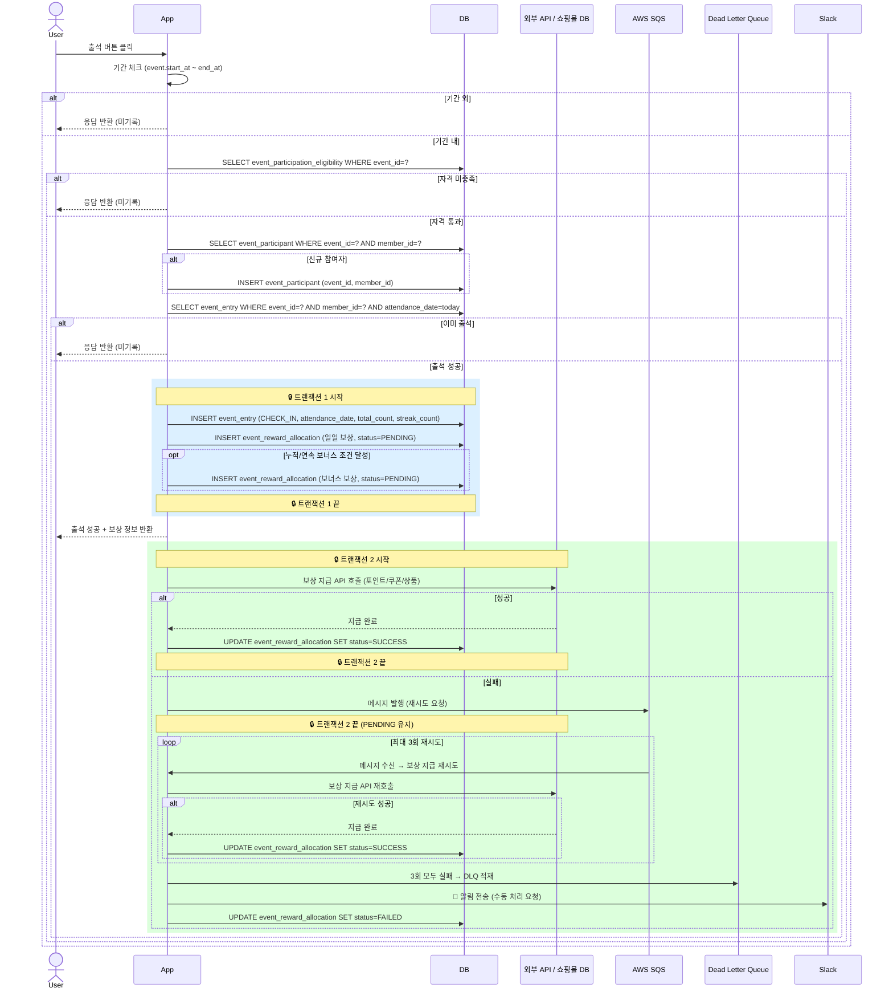
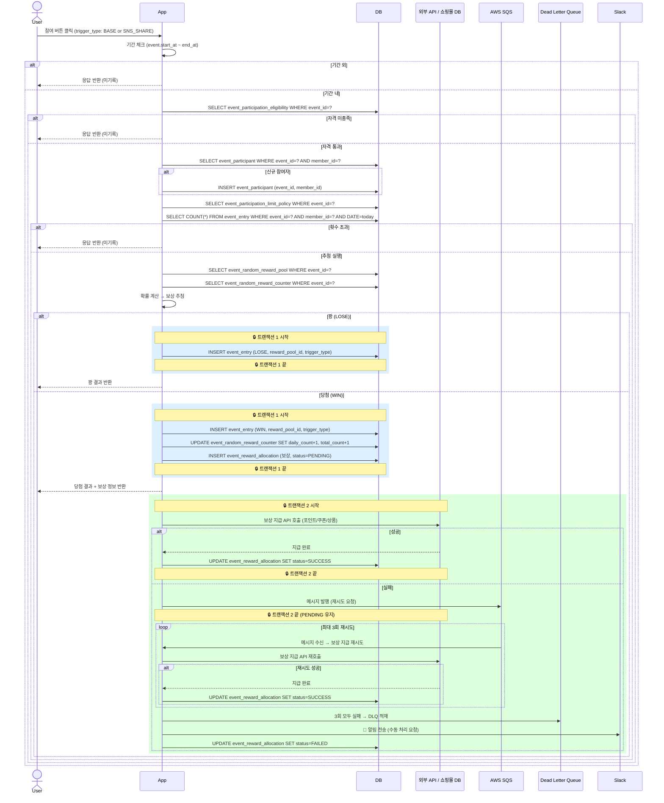

# event_entry 데이터 적재 Flow

## 역할

출석·랜덤 이벤트의 **게임 실행 결과만 append-only로 기록**하는 통합 로그 테이블.

| 상황 | event_entry |
|------|-----------|
| 기간 외 | ❌ 응답만 반환 |
| 자격 미충족 | ❌ 응답만 반환 |
| 횟수 제한 초과 | ❌ 응답만 반환 |
| 이미 출석 (중복) | ❌ 응답만 반환 |
| 출석 성공 (CHECK_IN) | ✅ 기록 |
| 랜덤 당첨 (WIN) | ✅ 기록 |
| 랜덤 꽝 (LOSE) | ✅ 기록 |

---

## 출석 이벤트 Flow

```
유저 출석 버튼 클릭
  │
  ├─ 기간 외           → 응답만 반환 (미기록)
  ├─ 자격 미충족        → 응답만 반환 (미기록)
  ├─ 이미 출석         → 응답만 반환 (미기록)
  └─ 출석 성공
       → event_entry INSERT (CHECK_IN, attendance_date, total_count, streak_count)
       → event_reward_allocation INSERT (일일 보상 PENDING)
       → 누적/연속 조건 달성 시 event_reward_allocation INSERT (보너스 PENDING)
```

### 출석 성공 시 저장 예시

```sql
id=1,
event_id=1, event_type='ATTENDANCE', member_id=10001,
action_result='CHECK_IN',
attendance_date='2026-03-05',
total_attendance_count=5,
streak_attendance_count=3,
trigger_type=NULL, reward_pool_id=NULL
```

---

## 랜덤 이벤트 Flow

```
유저 참여 버튼 클릭 (trigger_type: BASE or SNS_SHARE)
  │
  ├─ 기간 외           → 응답만 반환 (미기록)
  ├─ 자격 미충족        → 응답만 반환 (미기록)
  ├─ 횟수 제한 초과     → 응답만 반환 (미기록)
  └─ 추첨 실행
       ├─ 꽝 (LOSE)  → event_entry INSERT (LOSE, reward_pool_id, trigger_type)
       └─ 당첨 (WIN) → event_entry INSERT (WIN, reward_pool_id, trigger_type)
                    → event_random_reward_counter UPDATE (+1)
                    → event_reward_allocation INSERT (보상 PENDING)
```

### trigger_type 구분

| trigger_type | 의미 |
|---|---|
| `BASE` | 기본 참여 |
| `SNS_SHARE` | SNS 공유 후 추가 참여 |

### 랜덤 저장 예시

```sql
-- BASE 당첨
id=2, event_id=2, event_type='RANDOM', member_id=10001,
action_result='WIN', trigger_type='BASE', reward_pool_id=2

-- SNS_SHARE 꽝
id=3, event_id=2, event_type='RANDOM', member_id=10001,
action_result='LOSE', trigger_type='SNS_SHARE', reward_pool_id=5
```

---

## UML (Sequence Diagram)

### 출석 이벤트



### 랜덤 이벤트



---

## 컬럼 사용 매핑

| 컬럼 | ATTENDANCE | RANDOM |
|------|-----------|--------|
| `attendance_date` | ✅ | ❌ NULL |
| `total_attendance_count` | ✅ | ❌ NULL |
| `streak_attendance_count` | ✅ | ❌ NULL |
| `trigger_type` | ❌ NULL | ✅ |
| `reward_pool_id` | ❌ NULL | ✅ (WIN/LOSE) |
