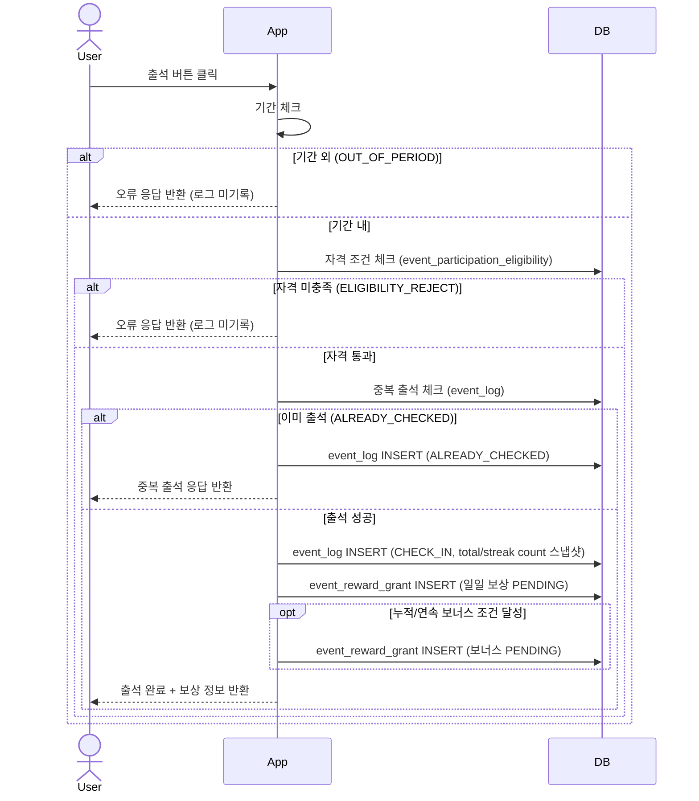
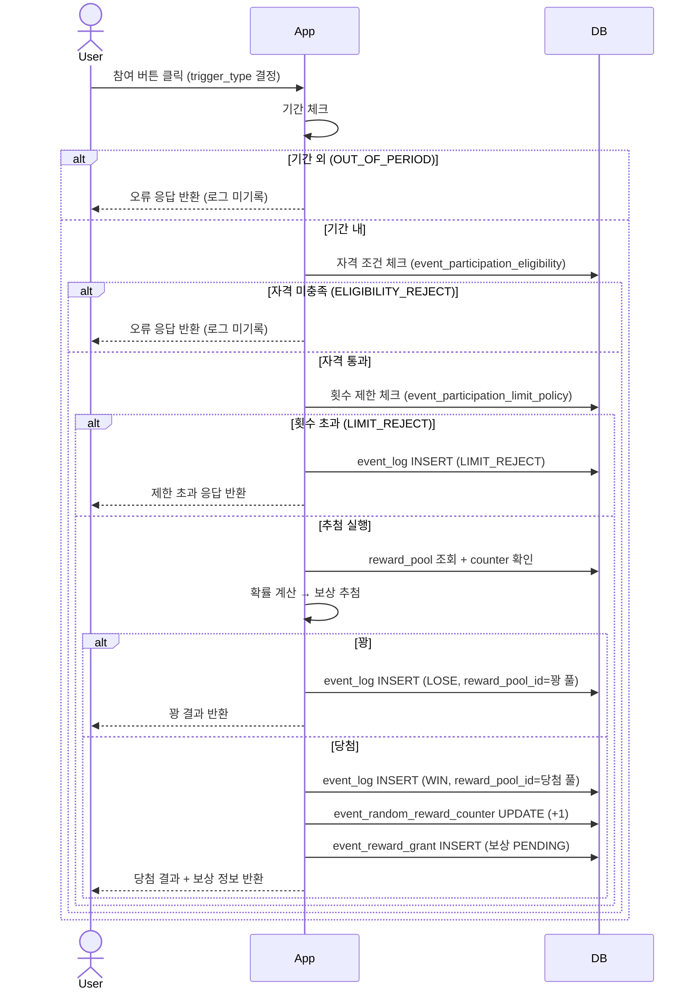

# event_log 데이터 적재 Flow

## 역할

출석·랜덤 이벤트의 **실제 참여 시도를 append-only로 기록**하는 통합 로그 테이블.  
기간 외·자격 미충족은 응답만 반환하고 로그에 기록하지 않음.

---

## 출석 이벤트 Flow

```
유저 출석 버튼 클릭
  │
  ├─ 기간 외           → 로그 미기록, 응답만 반환 (OUT_OF_PERIOD)
  ├─ 자격 미충족        → 로그 미기록, 응답만 반환 (ELIGIBILITY_REJECT)
  ├─ 이미 출석         → event_log INSERT (action_result='ALREADY_CHECKED')
  └─ 출석 성공
       → event_log INSERT (action_result='CHECK_IN')
       → event_reward_grant INSERT (일일 보상 PENDING)
       → 누적/연속 조건 달성 시 event_reward_grant INSERT (보너스 PENDING)
```

### 출석 성공 시 저장 예시

```sql
id=1,
event_id=1, event_type='ATTENDANCE', member_id=10001,
action_result='CHECK_IN',
attendance_date='2026-03-05',
total_attendance_count=5,     -- 총 누적 5일째
streak_attendance_count=3,    -- 연속 3일째
trigger_type=NULL, reward_pool_id=NULL,
created_at='2026-03-05 09:10:00'
```

---

## 랜덤 이벤트 Flow

```
유저 참여 버튼 클릭
  │
  ├─ 기간 외           → 로그 미기록, 응답만 반환 (OUT_OF_PERIOD)
  ├─ 자격 미충족        → 로그 미기록, 응답만 반환 (ELIGIBILITY_REJECT)
  ├─ 횟수 제한 초과     → event_log INSERT (action_result='LIMIT_REJECT')
  └─ 추첨 실행
       ├─ 꽝(NONE)     → event_log INSERT (action_result='LOSE', reward_pool_id=꽝풀id)
       └─ 당첨
            → event_log INSERT (action_result='WIN', reward_pool_id=당첨풀id)
            → event_reward_grant INSERT (보상 PENDING)
```

### trigger_type 구분

| trigger_type | 의미 |
|---|---|
| `BASE` | 기본 참여 (하루 1회 기본 게임) |
| `SNS_SHARE` | SNS 공유 후 추가 참여권으로 실행 |

### 랜덤 당첨 시 저장 예시

```sql
-- BASE 참여 당첨
id=3,
event_id=2, event_type='RANDOM', member_id=10001,
action_result='WIN',
trigger_type='BASE',
reward_pool_id=2,              -- 당첨된 보상 풀 (포인트 100P 풀)
attendance_date=NULL, total_attendance_count=NULL, streak_attendance_count=NULL,
created_at='2026-03-05 10:05:00'

-- SNS 추가 참여 당첨
id=4,
event_id=2, event_type='RANDOM', member_id=10001,
action_result='WIN',
trigger_type='SNS_SHARE',
reward_pool_id=1,
created_at='2026-03-05 10:30:00'
```

---

## UML (Sequence Diagram)

### 출석 이벤트



### 랜덤 이벤트



---

## 컬럼 사용 매핑

| 컬럼 | ATTENDANCE | RANDOM |
|------|-----------|--------|
| `attendance_date` | ✅ | ❌ NULL |
| `total_attendance_count` | ✅ (CHECK_IN만) | ❌ NULL |
| `streak_attendance_count` | ✅ (CHECK_IN만) | ❌ NULL |
| `trigger_type` | ❌ NULL | ✅ |
| `reward_pool_id` | ❌ NULL | ✅ (WIN/LOSE만) |
| `failure_reason` | ✅ (실패 시) | ✅ (실패 시) |

---

## 로그 미기록 정책

| 상황 | 처리 |
|------|------|
| 기간 외 (OUT_OF_PERIOD) | 응답만 반환, event_log 미기록 |
| 자격 미충족 (ELIGIBILITY_REJECT) | 응답만 반환, event_log 미기록 |
| 이미 출석 (ALREADY_CHECKED) | event_log 기록 |
| 횟수 제한 초과 (LIMIT_REJECT) | event_log 기록 |
| 출석 성공 / 당첨 / 꽝 | event_log 기록 |
